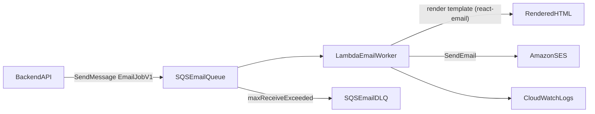

# Worker Implementation Plan (SQS + Lambda + SES + react-email)

## 1) Scope and Objective

Build a separate worker service that consumes asynchronous email jobs and sends transactional emails reliably.  
The first scope covers:
- login invitation email
- forgot password email
- reset password confirmation email

Future scope:
- notifications
- exports/download completion
- other background tasks

## 2) High-Level Architecture



## 3) Why This Stack

- SQS gives durable async buffering and decoupling.
- Lambda gives low idle cost and automatic scaling.
- SES is low-cost, cloud-native email.
- react-email improves template developer experience.
- TypeScript maintains contract consistency across producer and consumer.
- Separate worker repo enforces clear service boundaries.

## 4) Repository Plan

Service repo name: `todo-worker`  
Current directory docs prepared under: `worker/`

### Target source layout

```text
src/
  index.ts
  contracts/
    emailJob.ts
  handlers/
    loginInvitation.ts
    forgotPassword.ts
    resetPassword.ts
  templates/
    InviteEmail.tsx
    ForgotPasswordEmail.tsx
    ResetPasswordEmail.tsx
  services/
    mailer.ts
    idempotency.ts
    messageRouter.ts
  config/
    env.ts
  lib/
    logger.ts
```

## 5) Implementation Phases

### Phase A - AWS Foundation

1. Select one AWS region for all related resources.
2. Configure SES identity:
   - verify sender domain or sender email
   - apply SPF/DKIM DNS records
3. Create queues:
   - main queue: `email-v1`
   - dead-letter queue: `email-v1-dlq`
4. Configure redrive policy:
   - `maxReceiveCount` recommended `5`
5. Prepare IAM role for Lambda:
   - SQS receive/delete/change visibility
   - SES send email
   - CloudWatch logs write
   - DynamoDB read/write if idempotency table is used

### Phase B - Worker Contracts and Validation

1. Define `EmailJobV1` contract in `src/contracts/emailJob.ts`.
2. Add runtime validation (zod) for:
   - SQS body parse
   - required fields
   - template-specific variables
3. Add strict type-safe discriminated unions for message types.

### Phase C - Lambda Consumer and Router

1. `src/index.ts` handles batched `SQSEvent`.
2. Parse each message body safely.
3. Route by `type` to dedicated handler:
   - `auth.login_invitation.v1`
   - `auth.forgot_password.v1`
   - `auth.reset_password.v1`
4. Return partial batch response for failures so only failed records retry.

### Phase D - Template and Mail Delivery

1. Build template components with react-email.
2. Render HTML using `@react-email/render`.
3. Send via SES (`@aws-sdk/client-ses`) from `services/mailer.ts`.
4. Include plain text fallback.

### Phase E - Idempotency and Retry Safety

1. Generate idempotency key:
   - `email:{type}:{recipient}:{eventId}`
2. Track send state in DynamoDB (recommended) with TTL.
3. Skip duplicate sends when message is replayed.
4. Distinguish retryable vs non-retryable failures.

### Phase F - Observability and Operations

1. Structured logs with correlation fields:
   - `messageId`, `eventId`, `type`, `recipient`, `status`
2. CloudWatch alarms:
   - Lambda error rate
   - DLQ depth > 0
3. Add dashboards for send success/failure trends.

### Phase G - Rollout

1. Deploy worker with only invitation template enabled.
2. Connect backend producer to SQS.
3. Validate end-to-end in staging.
4. Enable production gradually:
   - invite first
   - forgot password next
   - reset confirmation last

## 6) Backend Producer Integration Plan

Backend side should:
1. publish `EmailJobV1` to SQS (not send email directly).
2. keep request/response path synchronous and fast.
3. generate deterministic `eventId` per event for idempotency.
4. apply feature flags:
   - `EMAIL_ENABLED`
   - `EMAIL_QUEUE_ENABLED`

## 7) Local and Pre-Prod Testing Plan

### Local

- Unit test:
  - contract validation
  - message routing
  - template rendering snapshots
  - SES client abstraction with mock

### Staging

- End-to-end:
  - enqueue one job per type
  - verify SES send success
  - verify retry behavior by forced temporary failures
  - verify DLQ movement on repeated failure

### Production readiness gate

- SES identity verified
- alarms active
- idempotency enabled
- DLQ processing playbook documented

## 8) Cost and Sustainability Notes

- SQS + Lambda + SES is cost-efficient at low and moderate scale.
- Use small Lambda memory initially; tune after observing duration.
- Keep logs structured and concise to control CloudWatch cost.
- Use one queue and one worker function initially; split only when required by throughput.

## 9) Risks and Mitigation

- Risk: duplicate email on retries  
  Mitigation: idempotency key + store

- Risk: invalid payload drift across services  
  Mitigation: shared contract versioning + runtime validation

- Risk: silent failed processing  
  Mitigation: DLQ + alarms + dashboard

- Risk: deliverability issues  
  Mitigation: domain verification, SPF/DKIM, suppression handling

## 10) Exit Criteria

This phase is complete when:
1. backend publishes valid `EmailJobV1` messages to SQS,
2. Lambda consumes and routes correctly,
3. SES sends all three email types successfully,
4. duplicate sends are prevented under retries,
5. alarms and DLQ monitoring are operational.
